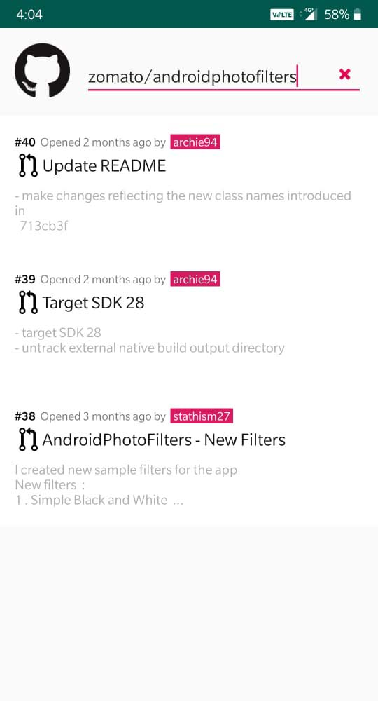

# ListPullRequests

Repository containing source code of android app which lists all the open pull requests for the given public Github repository.

Application is built using reactive/functional approach and MVP architecture.

## App Screenshot
